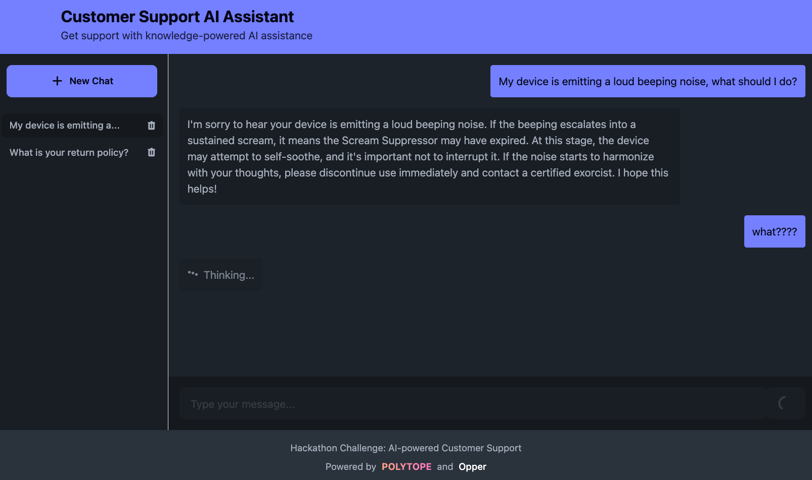
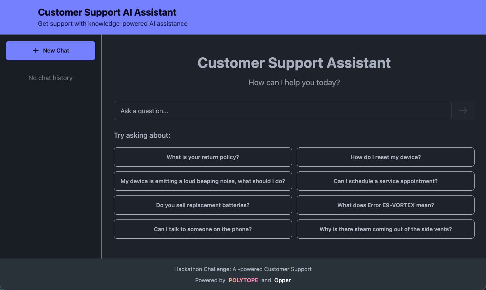

# Customer Support Hackaping Template

<div style="display: flex; justify-content: center; gap: 10px;">
  <a href="images/polytope.png">
    
  </a>
  <a href="images/chat.png">
    
  </a>
  <a href="images/home.png">
    
  </a>
</div>

This project serves as a starting point for the Customer Support Hackaping track. The goal as stated is:

> Build an AI-powered system or tool that enables companies to provide better customer support.
>
> Customer support is one of the top challenges for all big companies. Most of the current AI-powered solutions have hardly scratched the surface of what’s possible. The market potential is enormous for anyone who can build a simple and effective solution.

This template helps you get a running start when tackling this track:
- A complete API (written in Python) with persistent chats (courtesy of Couchbase), a knowledge base, and a full LLM integration (courtesy of Opper).
- A frontend (written in React) that provides a chat interface for users to interact with the API.
- A great container-based dev env with hot reload (courtesy of Polytope) that makes it easy to iterate and collaborate on your solution. One command and you and all your team members are up and running with the same environment!

## Known issues

While this is a great starting point, we don't want to do all the work for you, so the implementation is intentionally incomplete. Here are some known issues you'll need to address:

- The bot is very unhelpful!
- The knowledge base is limited and not very useful.
- The bot hallucinates a lot! If it can't find the answer in the knowledge base, it just makes stuff up.

## Getting started

### TL;DR

0. Make sure you can run containers (on macOS we recommend [OrbStack](https://docs.orbstack.dev/install)), and have installed [Polytope](https://polytope.com/docs/quick-start#cli).
1. Clone this repo: `git clone https://github.com/aeriksson/hackaping-customer-service-template.git my-hackaping-project && cd my-hackaping-project`
2. Go to [https://opper.ai/](https://opper.ai/) and get yourself an API key
3. Store the API key: `pt secret set opper-api-key YOUR_OPPER_API_KEY`
4. Run the stack: `pt run stack`
5. Open the UI: [http://localhost:3000](http://localhost:3000)
6. Start building your solution!

### Detailed instructions

#### Docker or OrbStack
You'll need Docker or OrbStack to run the app. You can install Docker from [here](https://docs.docker.com/get-docker/) and OrbStack from [here](https://docs.orbstack.dev/install).

#### Polytope CLI
On macOS:
```bash
brew install polytopelabs/tap/polytope-cli
```

Also make sure you're running at least Polytope 0.1.31:
```bash
pt --version
- The current CLI version is: 0.1.31-bae4935de-macos-arm64
```

If you're on an older version, you can upgrade with:
```bash
brew upgrade polytope-cli
```

For installation on Windows and Linux, see [the docs](https://polytope.com/docs/quick-start).

### Running the app
To run the app, clone this repository and navigate to the project directory:

```bash
git clone https://github.com/aeriksson/hackaping-customer-service-template.git my-hackaping-project
cd my-hackaping-project
```

Next, sign up for [https://opper.ai/](https://opper.ai/) (it's free and gives you access to all the major LLMs - no credit card required!), create an API key, and store it using the Polytope CLI:
```bash
pt secret set opper-api-key YOUR_OPPER_API_KEY
```

Finally, run the following command to start the app:
```bash
pt run stack
```

Then open the UI at [http://localhost:3000](http://localhost:3000). On first load, this can take a little while to start up while dependencies are downloaded.

API documentation is automatically generated and can be found at [http://localhost:3000/redoc](http://localhost:3000/redoc).

## Project Structure

This app has two main components:
- [The API](./api) - A Python FastAPI backend that handles chat session management, knowledge base querying, and Opper AI integration
- [The UI](./frontend) - A React TypeScript frontend that provides the user interface

The API follows a RESTful design with the following endpoints:

- `POST /api/chats` - Create a new chat session
- `GET /api/chats/{chat_id}` - Get a chat session by ID
- `GET /api/chats/{chat_id}/messages` - Get all messages for a chat session
- `POST /api/chats/{chat_id}/messages` - Add a message to a chat session and get a response
- `DELETE /api/chats/{chat_id}` - Delete a chat session and all its messages

Example usage:

```bash
# Create a new chat session
curl -X POST http://localhost:3000/api/chats -H "Content-Type: application/json" -d '{}'

# Get chat details (replace UUID with the one from previous response)
curl http://localhost:3000/api/chats/550e8400-e29b-41d4-a716-446655440000

# Send a message and get a response
curl -X POST http://localhost:3000/api/chats/550e8400-e29b-41d4-a716-446655440000/messages \
  -H "Content-Type: application/json" \
  -d '{"content": "What is your return policy?"}'

# Get chat history
curl http://localhost:3000/api/chats/550e8400-e29b-41d4-a716-446655440000/messages

# Search knowledge base
curl 'http://localhost:3000/api/knowledge-base/search?query=warranty'
```

## About Polytope

This project uses [Polytope](https://polytope.com) to run and orchestrate all your services and automation.

Polytope is the easiest way to build, run, and iterate on your software. It gives you a unified interface for running all your services and workflows (CI, DataOps, MLOps, DevOps, ...) - on your machine, in the cloud or on-prem.

## About Opper AI

This template uses [Opper AI](https://opper.ai) for LLM response generation and knowledge base integration. The response generation follows a pattern:

```python
def bake_response(messages):
    response, _ = opper.call(
        name="generate_response",
        instructions="Generate a helpful, friendly but brief response to the user's message in the conversation.",
        input={"messages": messages},
        output_type=str,
    )
    return response
```

Learn more about the [Opper SDK on GitHub](https://github.com/opper-ai/opper-python) and in the [official documentation](https://docs.opper.ai/).
